
<h1 align="center">网上点餐系统</h1>

## 简介
网上点餐系统：角色分为管理员和用户；功能涵盖用户管理、美食管理、订单管理和评价管理，实现店铺信息编辑、用户交互体验和订单审核等综合在线服务。    --计算机毕业设计源码；毕设源码；java毕业设计源码

## 联系方式

<h3 align="center">获取完整代码与数据库文件 + 微信：deepguan QQ: 86050149 QQ群: 783742310</h3>

<h3 align="center">可帮忙远程部署 包运行成功！提供远程部署、修改代码、设计文档指导、代码讲解等服务！</h3>

## 功能介绍（完整见运行截图）
管理员：基本功能包括登录、注册和安全退出。管理员可以通过左侧导航菜单访问个人中心、用户管理、美食管理、订单管理和系统管理等功能模块。管理界面支持新增、修改和删除美食分类、店铺信息及用户信息，并允许订单的审核和美食评价的管理。管理员主页有搜索栏可根据店铺账号或名称进行快速查询，确保管理的效率和准确性。

店铺用户：店铺用户可进行独立的登录和注册，登录后进入个人中心编辑店铺信息，包括上传照片、修改名称、联系方式、地址和招牌美食信息等。功能菜单包含信息管理、订单管理和评价管理等模块，帮助店铺用户完善信息和跟踪订单。店铺用户可以管理自己的美食信息，上传相关图片，设置美食特点和价格，以及查看评价和进行必要的操作。

普通用户：用户需通过注册或登录进入系统，访问个人中心进行信息修改，如更新个人资料、头像、联系方式和配送地址。用户界面支持浏览美食列表、查看美食店信息、评价店铺和管理订单。用户可以通过购物车功能进行在线点单、浏览购物车详情、修改或删除已选菜品，并可以通过订单详情页确认和提交订单。提供直观的分类和搜索功能以提升用户点餐体验。

系统用户（所有角色）：所有用户角色均具有访问个人中心的功能，进行个人信息管理，例如更新账户信息、查看历史订单详情和管理收藏夹。同时，不同角色通过选择适当的导航菜单，可以快速切换到系统的不同功能模块，进行如美食店的展示、订单及评价管理等操作，以满足各自的使用需求。这些设计共同为用户提供了一个简洁、高效的网上点餐体验。

## 运行截图
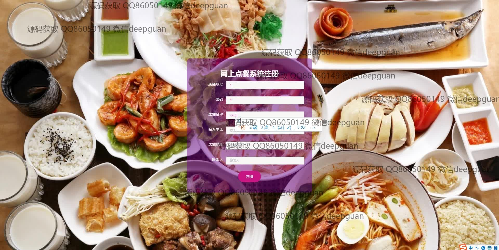

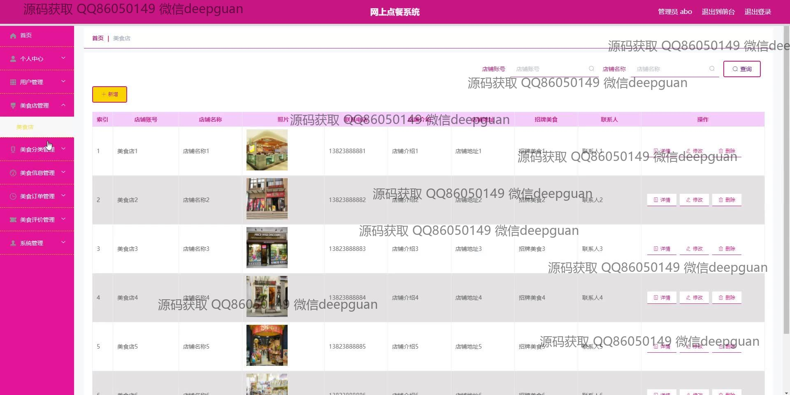
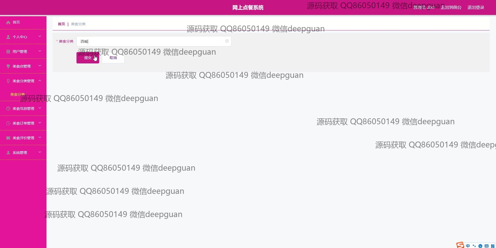
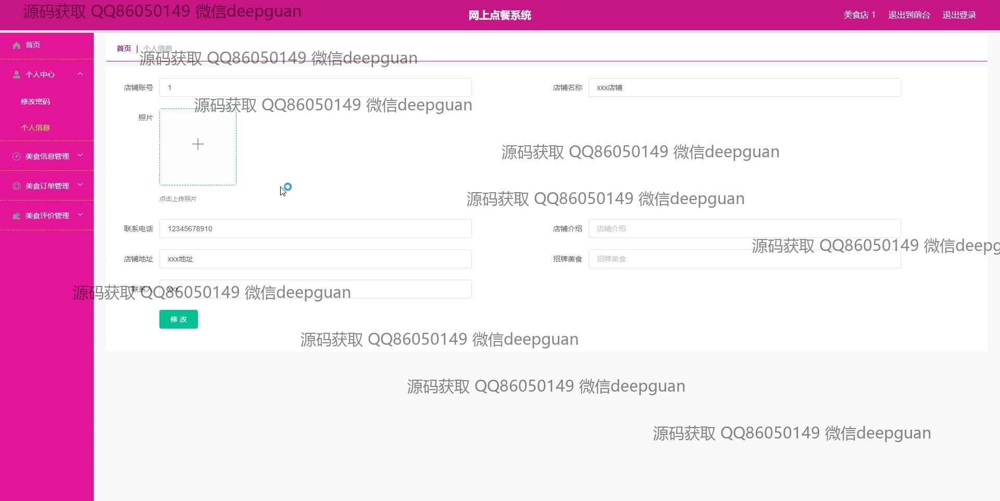
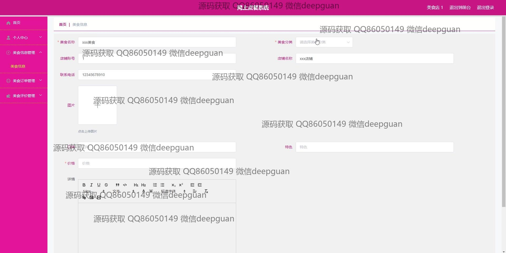
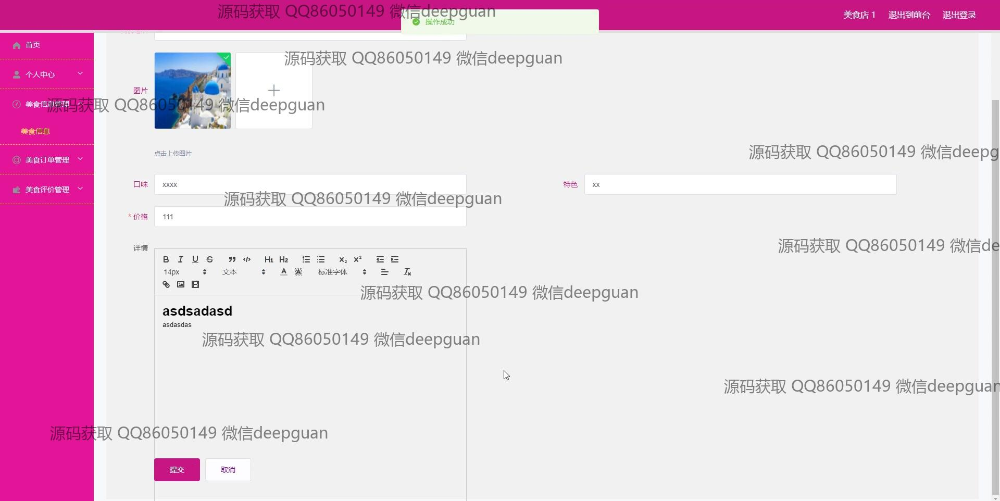
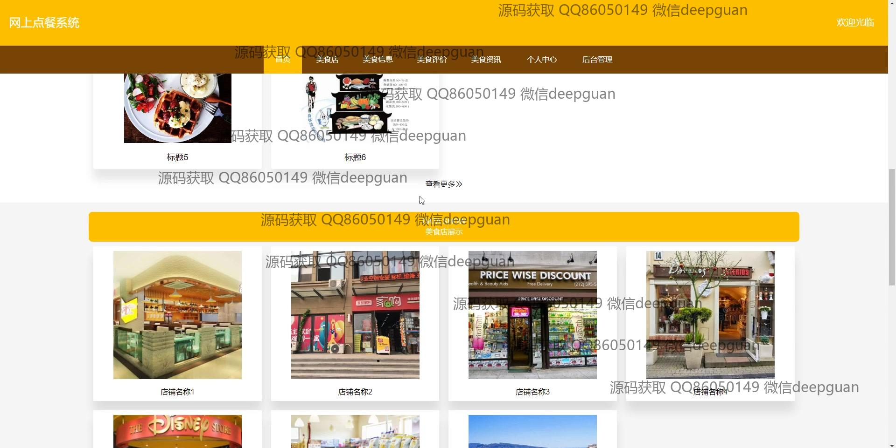
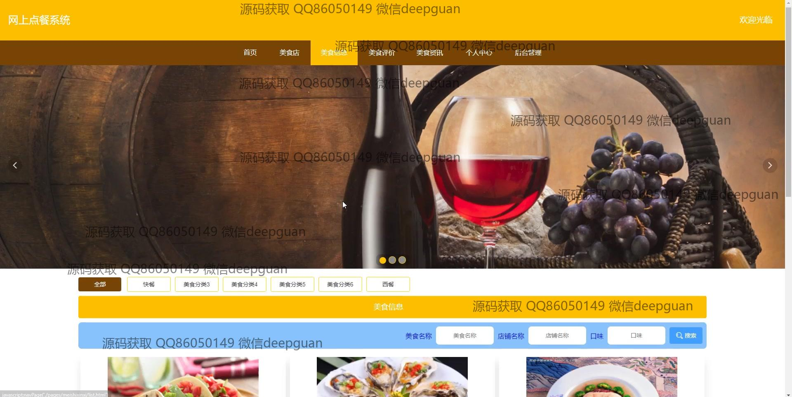
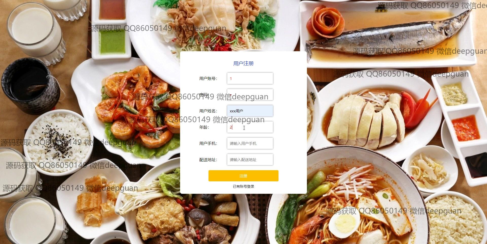
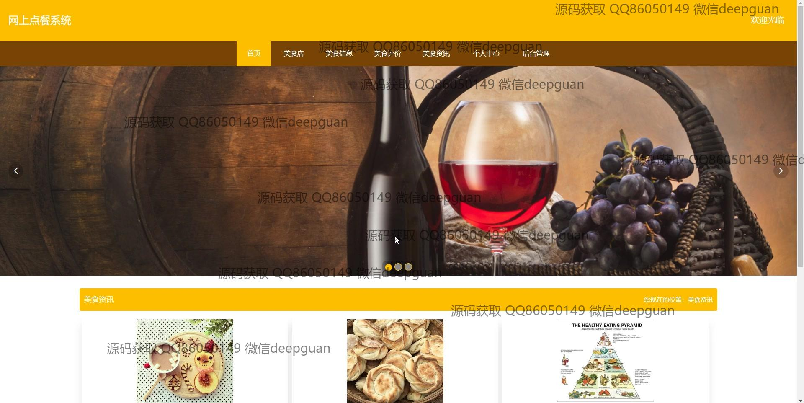
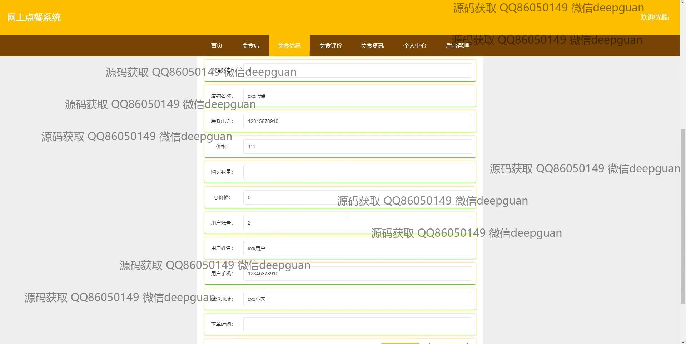
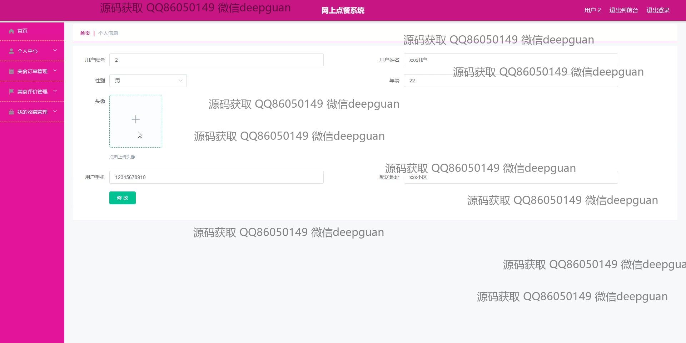
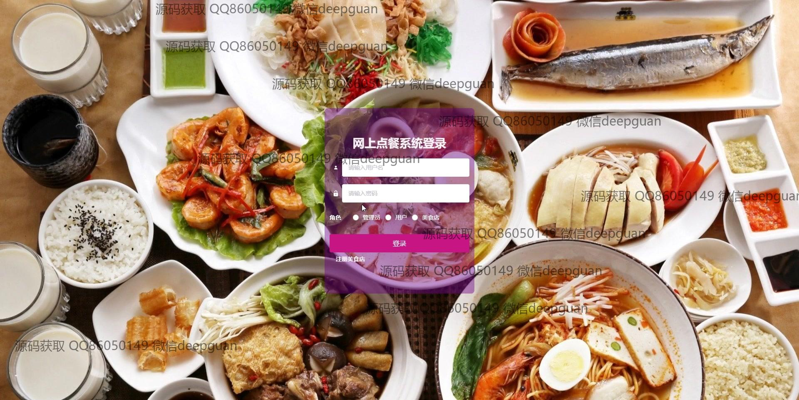
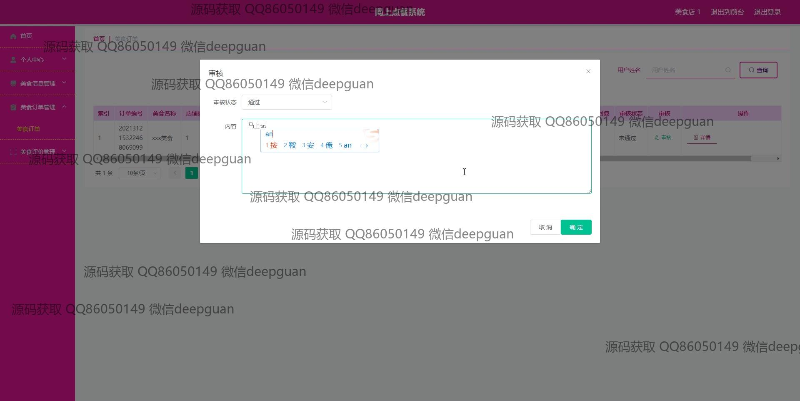
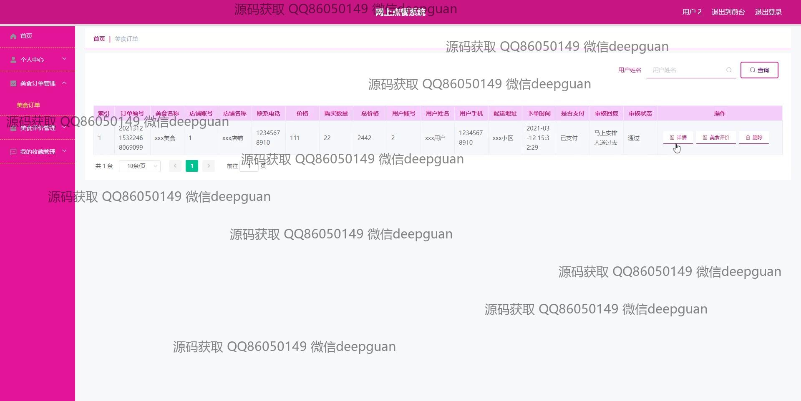
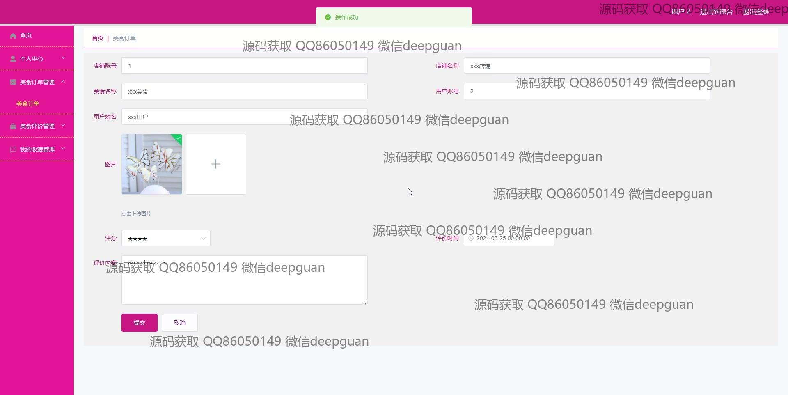
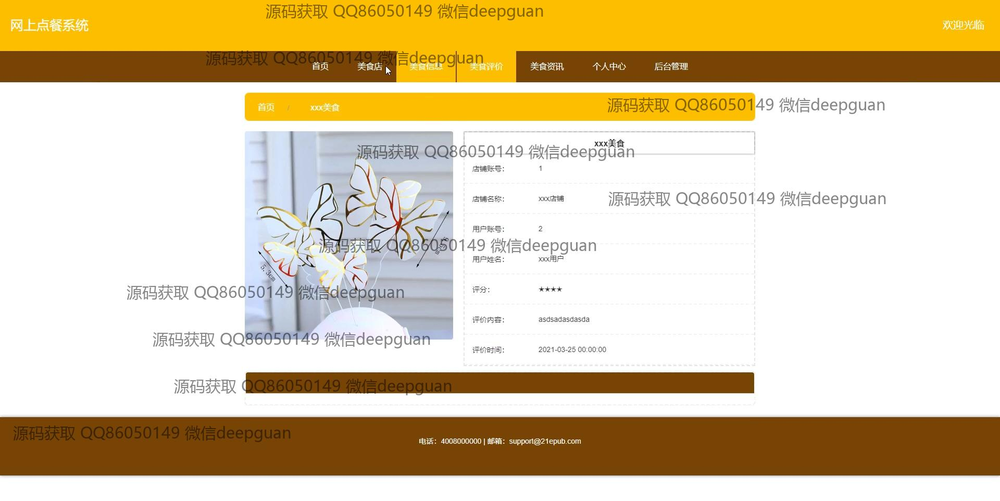

本代码来源于网络,仅供学习参考使用!

